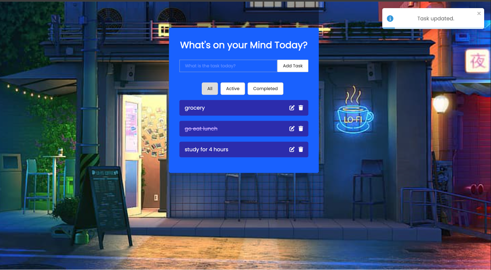

# Todo App

This is a simple Todo application built with React. It allows users to add, edit, delete, and mark todos as completed. Users can also filter todos based on their completion status.

## Features

- **Add Task:** To add a new todo, type the task in the input field and press "Add Task".
- **Edit Existing Todos:** To edit a todo, click on the edit icon next to the todo, update the task in the input field, and press "Update Task".
- **Mark Todos as Completed:** Users can toggle between Celsius and Fahrenheit units to view temperature.
- **Delete Todos:** To mark a todo as completed, click on the task's text.
- **Filter Todos (All, Active, Completed):** To see your progress, can click on either of the All, Active and Completed buttons on the top

## Technologies Used

- React: Frontend framework for building the user interface.
- Font Awesome: Used for displaying search and weather icons.
- React-Toastfy: Use for displaying notification when adding, deleting and updating a task
- Google Fonts: Used for the Poppins font family.

## Setup

1. Clone the repository:

```bash
git clone https://github.com/yourusername/weather-app.git
```

2. Navigate to project-directory:

```bash
cd ${path_to_directory}
```

3. Install dependencies:
```bash
npm install
```

4. Start the development server:
```bash
npm start
```

5. Open your brower and visit http://localhost:3000 to view the app


## Demo
