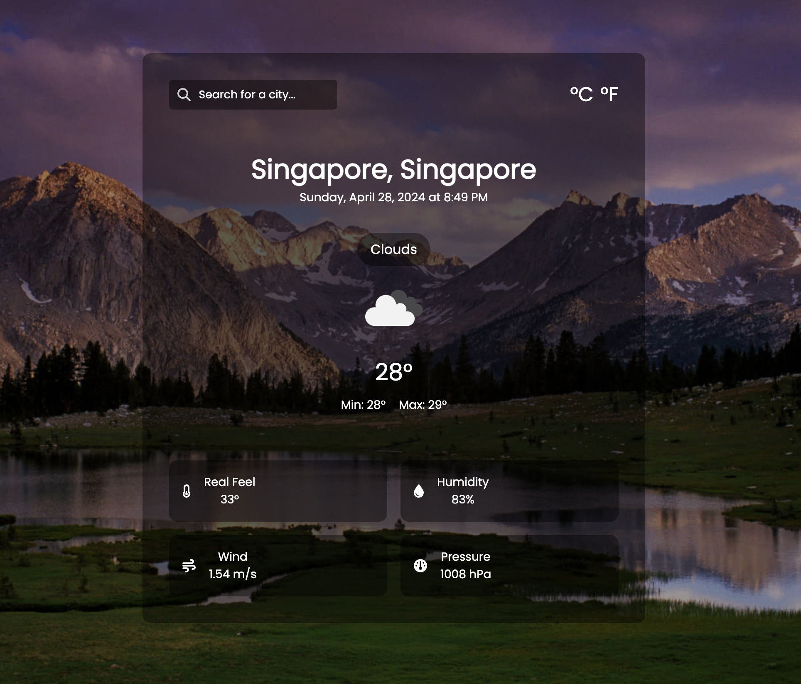

# Weather App

This Weather App is a simple web application that allows users to search for weather information of different cities. It provides real-time weather data including temperature, humidity, wind speed, and pressure.

## Features

- **City Search:** Users can search for weather information by entering the name of a city.
- **Weather Features:** Users can see the real feel, humiditym wind speed and atmospheric pressure
- **Unit Selection:** Users can toggle between Celsius and Fahrenheit units to view temperature.
- **Responsive Design:** The app is designed to be responsive and works well on both desktop and mobile devices.

## Technologies Used

- React: Frontend framework for building the user interface.
- OpenWeatherMap API: Used to fetch weather data for different cities.
- Font Awesome: Used for displaying search and weather icons.
- Google Fonts: Used for the Poppins font family.

## Warning
You need to get your own api key and replace it in WeatherData.jsx file on line 6 :

```javascript
const API_KEY = '//Your API Key';
```

## API Key Generation
1. Go to the following link: https://openweathermap.org/
2. Sign in/ Create a new account
3. Click on your username -> My API Keys
4. Copy your private API key under 'Key'

## Setup

1. Clone the repository:

```bash
git clone https://github.com/cyprus09/bluesheets-take-home.git
```

2. Navigate to project-directory:

```bash
cd ${path_to_directory}
```

3. Install dependencies:
```bash
npm install
```

4. Start the development server:
```bash
npm start
```

5. Open your brower and visit http://localhost:3000 to view the app


## Demo
